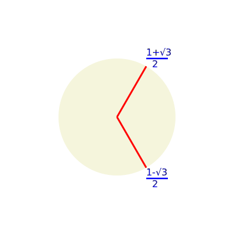
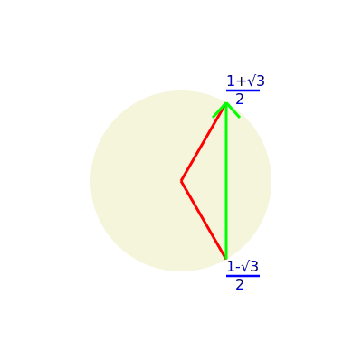
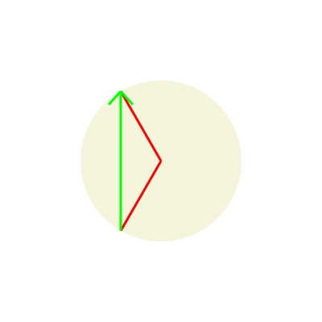

## 前言

我们已经知道[斐波那契数列](https://baike.baidu.com/item/%E6%96%90%E6%B3%A2%E9%82%A3%E5%A5%91%E6%95%B0%E5%88%97)是什么了

::: details 什么? 你不知道? 没事, 点此展开查看简要说明

在数学上, 斐波那契数是以递归的方法来定义:

$F_0=0$

$F_1=1$

$F_n = F_{n-1} + F_{n-2} \left( n \geqq{2} \right)$

用文字来说, 就是斐波那契数列由0和1开始, 之后的斐波那契数就是由之前的两数相加而得出

所以斐波那契数列的前几项分别是1、 1、 2、 3、 5、 8、 13、 21、 34、 55、 89 ......

:::warning

特别指出: 0不是第一项, 而是第零项

:::

并且, 我们知道了斐波那契数列的通项公式

$$
F_n = \frac{
  \left(
    \frac{ {1} + \sqrt{5} }{2}
  \right) ^ {n}
  +
  \left(
    \frac{ {1} - \sqrt{5} }{2}
  \right) ^ {n}
}{ \sqrt{5} }
$$

由此, 我们就有了一个大胆的猜想, 我们为何仅仅局限于斐波那契数列的形式呢

## 正文

我们猜想, 对于一个数列 $a_n (n \geqq {0})$ 如果满足以下形式, 是否能推导出其通项公式

$a_0 = 0$

$a_1 = 1$

$a_n = k a_{n-1} + t a_{n-2} (k, t \in R, n \geqq 2)$

---

我们尝试使用初等代数求解(~~才不是因为我不会线性代数呢~~)

### 构造等比数列

对于 $a_n = k a_{n-1} + t a_{n-2}$ 这种递推形式, 我们不太好求解, 于是我们构造以下这个数列

设 $a_n + p a_{n-1} = q \left( a_{n-1} + p a_{n-2} \right)$

化简得 $a_n = \left( {q-p} \right) a_{n-1} + {pq} a_{n-2}$

与 $a_n = k a_{n-1} + t a_{n-2}$ 联立得

$$\begin{cases}
   q - p = k
   \\
   pq = t
\end{cases}$$

消元后用求根公式解得

$$\begin{cases}
   p = \frac{-k \pm \sqrt{ k^2 + 4t} }{2}
   \\
   q = \frac{k \pm \sqrt{ k^2 + 4t} }{2}
\end{cases}$$

我们发现, 如果 ${k^2 + 4t} \ngeqq {0}$ , 那么根号下将是负数, 这不符合实际, 也就是说我们构造成这个形式并不满足所有情况, 这时候我们应该怎么办呢?

我们稍后再讨论 ${k^2 + 4t} \ngeqq {0}$ 的情况, 这里我们规定 ${k^2 + 4t} \geqq {0}$

### 求出构造的数列的通项公式

我们令 $b_n = a_n + p a_{n-1} \left( n \geqq 1 \right)$

那么就有 $b_n = q b_{n-1}$

我们又知道 $b_1 = a_1 + p a_0 = 1$

由累乘法可得 $b_n =  q^{n-1} b_1 =  q^{n-1}$

我们就得出了构造的等比数列的通项公式, 即

$$
b_n = q^{n-1}
\left( n \geqq 1 \right)
$$

### 求出原数列的通项公式

在上一步中, 我们已经求得了 $b_n$ 的通项公式, 接下来我们继续求 $a_n$ 的通项公式

将 $b_n$ 的通项带入已转化的形式,即可得到如下形式

$$
a_n + p a_{n-1} = q^{n-1}
\left( n \geqq 1 \right)
$$

即

$$
a_n = -pa_{n-1} + q^{n-1}
\left( n \geqq 1 \right)
$$

我们构造如下形式

$$
a_n + uq^n = -p \left( a_{n-1} + uq^{n-1} \right)
\left( n \geqq 1 \right)
$$

化简后得到

$$
a_n = -p a_{n-1} - upq^{n-1} - uq^n
$$

与原式 ( $a_n = -pa_{n-1} + q^{n-1}$ ) 联立得

$$
-upq^{n-1} - uq^n = q^{n-1}
$$

解得

$$
u = \frac{ -1 }{ p + q}
$$

我们再令 $c_n = a_n + uq^n$ , 所以有

$$
c_n = -p c_{n-1}
\left( n \geqq 1 \right)
$$

又因为 $c_0 = a_0 + u = u$ , 由累乘法可得

$$
c_n = { \left( -p \right) }^n c_0 = u { \left( -p \right) } ^ n
$$

所以

$$
a_n = c_n - uq^n
= u { \left( -p \right) } ^ n - uq^n
= u \left( { \left( -p \right) } ^ n - q^n \right)
$$

将 $u , p , q$ 的值带入得

$$
a_n = \frac{ -1 }{ \frac{-k \pm \sqrt{ k^2 + 4t} }{2} + \frac{k \pm \sqrt{ k^2 + 4t} }{2} }
\left(
  { \left( - \frac{-k \pm \sqrt{ k^2 + 4t} }{2} \right) } ^ n -
  { \left( \frac{k \pm \sqrt{ k^2 + 4t} }{2} \right) } ^ n
\right)
$$

化简后可得

$$
a_n = \frac{
  { \left( \frac{k + \sqrt{ k^2 + 4t} }{2} \right) } ^ n -
  { \left( \frac{k - \sqrt{ k^2 + 4t} }{2} \right) } ^ n
}{ \sqrt{ k^2 + 4t} }
$$

这就是数列 $a_n = k a_{n-1} + t a_{n-2} (k, t \in R, n \geqq 2 且 a_0 = 0, a_1 = 1)$ 的通项公式

### 复平面上的发现

对于 $k^2 + 4t < 0$ 的情况, 我猜想, 会不会与二次方根求根公式一样, 将其变为整数后在后方加上虚数单位 $i$ , 也就是

$$
a_n = \frac{
  { \left( \frac{k + \sqrt{ - k^2 - 4t} i }{2} \right) } ^ n -
  { \left( \frac{k - \sqrt{ - k^2 - 4t} i }{2} \right) } ^ n
}{ \sqrt{ - k^2 - 4t} i }
$$

我随后立刻否定了这个想法, 认为分子上的 $i$ 有 $n$ 次方, 不一定能与分母上一次方的 $i$ 相互抵消而使得结果为实数

抱着试一试的心态, 我令 $k = 1$ , $t = -1$ , 于是得到

$$
a_n = \frac{
  { \left( \frac{1 + \sqrt{3} i }{2} \right) } ^ n -
  { \left( \frac{1 - \sqrt{3} i }{2} \right) } ^ n
}{ \sqrt{3} i }
$$

那么

$$
a_1 =\frac{ \frac{1 + \sqrt{3} i }{2} - \frac{1 - \sqrt{3} i }{2} }{ \sqrt{3} i }
= \frac{ \sqrt{3} i }{ \sqrt{3} i } = 1
$$

$$
a_2 = \frac{
  { \left( \frac{1 + \sqrt{3} i }{2} \right) } ^ 2 -
  { \left( \frac{1 - \sqrt{3} i }{2} \right) } ^ 2
}{ \sqrt{3} i }
= \frac{
  \frac{ -1 + \sqrt{3} i }{2} -
  \frac{ -1 - \sqrt{3} i }{2}
}{ \sqrt{3} i }
= \frac{ \sqrt{3} i }{ \sqrt{3} i }
= 1
$$

$$
a_3 = \frac{
  { \left( \frac{1 + \sqrt{3} i }{2} \right) } ^ 3 -
  { \left( \frac{1 - \sqrt{3} i }{2} \right) } ^ 3
}{ \sqrt{3} i }
= \frac{ \left( -1 \right) - \left( -1 \right) }{ \sqrt{3} i }
= 0
$$

经过验证后我们发现, 分子与分母的虚数确实可以恰好抵消

我开始思考怎么会出现这个巧合, 于是我画出了 $\frac{1 + \sqrt{3} i }{2}$ 和 $\frac{1 - \sqrt{3} i }{2}$ 在复平面上的图像, 如下图

于是我们惊奇地发现, 这两个数在复平面上是共轭的, 也就是说, 他们相减之后一定是平行于 $y$ 轴的, 如下图

而对于 ${ \left( \frac{1 + \sqrt{3} i }{2} \right) } ^ 2$ 和 ${ \left( \frac{1 - \sqrt{3} i }{2} \right) } ^ 2$ , 我们也同样可以画出它们的图像, 如下图

其实, 无论是1次方还是2次方亦或是 $n$ 次方, 这两个复数都是共轭的, 它们作差的结果一定是纯虚数

由此, 我们就可以将我们推导的公式延伸到更广的形式, 即

<!-- $$
a_n = \begin{cases}
  \frac{
    { \left( \frac{k + \sqrt{ k^2 + 4t} }{2} \right) } ^ n -
    { \left( \frac{k - \sqrt{ k^2 + 4t} }{2} \right) } ^ n
  }{ \sqrt{ k^2 + 4t} }
  \left( {k^2 + 4t} \geqq {0} \right)
  \\
  \frac{
    { \left( \frac{k + \sqrt{ - k^2 - 4t} i }{2} \right) } ^ n -
    { \left( \frac{k - \sqrt{ - k^2 - 4t} i }{2} \right) } ^ n
  }{ \sqrt{ k^2 + 4t} i }
  \left( k^2 + 4t < 0 \right)
\end{cases}
$$ -->

$$
a_n = \begin{cases}
  \frac{1}{ \sqrt{ k^2 + 4t} }
  \left(
    { \left( \frac{k + \sqrt{ k^2 + 4t} }{2} \right) } ^ n -
    { \left( \frac{k - \sqrt{ k^2 + 4t} }{2} \right) } ^ n
  \right)
  \left( {k^2 + 4t} \geqq {0} \right)
  \\
  \frac{1}{ \sqrt{ k^2 + 4t} i }
  \left(
    { \left( \frac{k + \sqrt{ - k^2 - 4t} i }{2} \right) } ^ n -
    { \left( \frac{k - \sqrt{ - k^2 - 4t} i }{2} \right) } ^ n
  \right)
  \left( k^2 + 4t < 0 \right)
\end{cases}
$$

## 结语

花了好几天的时间推导出这个, 算是一个有趣的小发现吧, 顺便记录了下来, 数学还是很多奇妙的东西的嘛.

其实已经有人推导出对于数列 $a_n = \sum_{ i=1 }^{ m }{ k_i a_{n-i}} (k_i \in R, n \geqq m)$ 的通项公式了, 本人能力有限就不推了(~~其实是根本不会~~).

全文完
